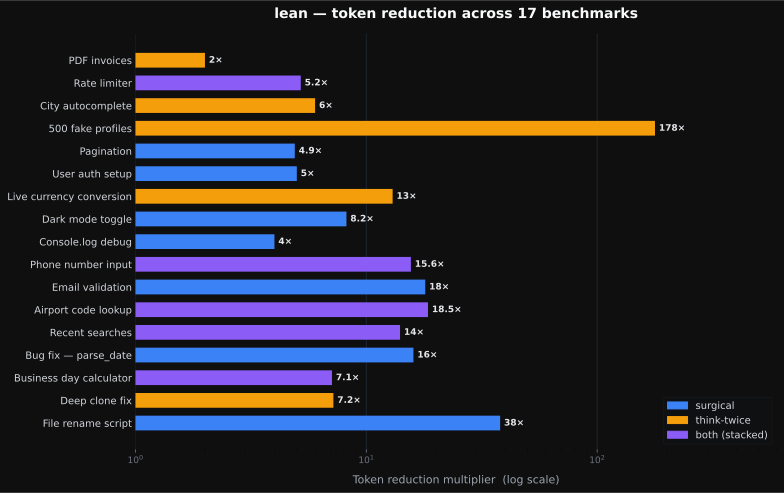
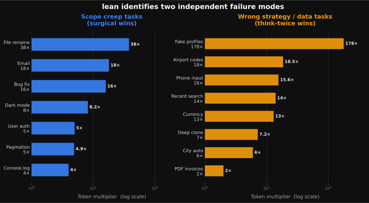
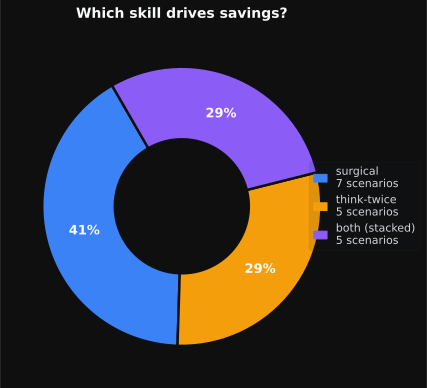

<div align="center">


<h1>lazy-cat</h1>
<h3><em>The best tokens are the ones you never spent.</em></h3>

[](LICENSE)
[](https://claude.ai/code)
[](https://github.com/albertobarnabo/lazy-cat)
[](#token-cost-at-a-glance)

<br/>

> *"A great engineer is a lazy engineer. They find the clever shortcut."* — Steve Jobs

Cats don't run when they can walk. **lazy-cat** gives Claude the same instinct great engineers are known for:<br/>pause before working hard, and make sure you can't work smart instead.

</div>

---

## The Problem: AI Agents Are Wasteful

Lean manufacturing has a word for unnecessary work: *muda*. Waste. Toyota built the world's most efficient production system by obsessing over eliminating it.

AI agents have a muda problem. Given any task, Claude charges ahead with the most obvious implementation — thorough, from scratch, at full cost — without stopping to ask: *is there a smarter path?* And once it's writing, it adds everything it can think of: error handling, tests, abstractions, refactors — none of which was asked for.

The result: thousands of unnecessary tokens. Work that didn't need to happen. Waste.

**lazy-cat fixes this at the only two moments that matter.**

---

## Two Skills. Two Moments.

| Skill | When it fires | What it prevents |
|---|---|---|
| [**think-twice**](skills/think-twice/) | Before picking an approach | Implementing from scratch when an API, package, or one-liner already exists |
| [**surgical**](skills/surgical/) | Before writing each block | Adding error handling, tests, and abstractions nobody asked for |

think-twice asks: *is there a smarter path?*
surgical asks: *did the user actually ask for this?*

Together they enforce lazy-cat at every level — strategy and execution.

---

## Token Cost at a Glance

Ask Claude to generate 500 staging user profiles. Without lazy-cat, it writes every profile inline — all 500, field by field, 66,320 tokens of output. With lazy-cat, it writes a 54-line faker script instead. 372 tokens.

> **Without lazy-cat:** ~66,320 tokens — about **$1.00** at Claude Sonnet API pricing.
> **With lazy-cat:** ~372 tokens — about **half a cent.**
> Same result. 178× the cost.

That's not an edge case. That's the default behavior of every AI that hasn't been taught to think first.

| Task | Greedy | Lean | Multiplier |
|---|---|---|---|
| 500 fake user profiles | ~66,320 tok | ~372 tok | **178×** |
| File rename script | ~725 tok | ~19 tok | **38×** |
| Email validation | ~1,675 tok | ~93 tok | **18×** |
| Airport code lookup | ~1,710 tok | ~93 tok | **18×** |
| Bug fix — parse_date | ~962 tok | ~61 tok | **16×** |
| Phone number input | ~1,525 tok | ~98 tok | **16×** |
| Recent searches | ~1,010 tok | ~73 tok | **14×** |
| Live currency conversion | ~1,795 tok | ~134 tok | **13×** |
| Dark mode toggle | ~962 tok | ~117 tok | **8×** |
| Business day calculator | ~410 tok | ~58 tok | **7×** |
| Deep clone fix | ~287 tok | ~40 tok | **7×** |
| City autocomplete | ~2,460 tok | ~410 tok | **6×** |
| Rate limiter — sliding window | ~2,152 tok | ~414 tok | **5×** |
| User auth setup | ~967 tok | ~190 tok | **5×** |
| Pagination | ~995 tok | ~203 tok | **5×** |
| Console.log for debugging | ~419 tok | ~106 tok | **4×** |
| PDF invoice generation | ~4,281 tok | ~2,281 tok | **2×** |

These seventeen tasks — a normal vibe-coding afternoon — cost **88,655 tokens greedy vs. 4,762 tokens with lazy-cat**. That's a $1.10 difference, every time, without changing a single prompt.

*Real outputs from 17 benchmark scenarios, tested independently under three conditions each: think-twice only, surgical only, and both combined. [Three-way breakdown →](tests/summary.md)*

The gap isn't narrow. Across 17 real tasks — bug fixes, scripts, API integrations, data generation — savings range from **2× to 178×**, with a median of **8×**.

<div align="center">



</div>

That spread exists because the waste doesn't come from one place. There are two independent failure modes.

<div align="center">



</div>

**Scope creep** is Claude adding what you didn't ask for — `--dry-run` flags, docstrings, error handling, test suites — on top of a task with a fixed, bounded answer. The task is small; the creep is not. surgical catches this.

**Wrong strategy** is Claude picking the expensive path when a library, API, or built-in already solves it correctly and completely. 124 airports hardcoded when there are 10,000. A holiday set that expires January 1. Hand-rolled `deepClone` when `structuredClone()` is a built-in. think-twice catches this.

These aren't variations of the same problem — a task can trigger one, both, or neither. Which is why the skills are separate.

<div align="center">



</div>

surgical catches more scenarios by count. think-twice catches the expensive ones — the **178×** outlier lives in that slice. When both failure modes are present, the multipliers stack.

> **One honest caveat:** in 3 of 17 scenarios (dark mode toggle, pagination, user auth setup), surgical alone *outperformed* both skills combined. When think-twice redirects to a library whose setup boilerplate exceeds a minimal hand-rolled solution, adding it hurts. The skills are not always additive — which is why they're separate, and why the [full three-way breakdown](tests/summary.md) shows every condition.

---

## Real-World Examples

<details>
<summary><strong>"Generate 500 realistic user profiles for our staging database"</strong></summary>
<br/>

| | Greedy | Lean |
|---|---|---|
| **Approach** | Writes 500 JSON records inline | 54-line `@faker-js/faker` script, parameterized |
| **Tokens** | ~66,320 | ~372 — **178x fewer** |
| **Data quality** | Repetitive (~30 names recycled) | Statistically varied, 50+ locales |
| **Bcrypt hashes** | Fake hashes — not login-usable | Real hashes — login-usable |
| **Re-runnability** | Zero — ephemeral output | Seeded, version-controlled, `--count` flag |
| **Checkpoints** | — | think-twice #2 (faker) + #3 (500 static = wrong shape) |

</details>

<details>
<summary><strong>"Write a script to rename all .jpeg files to .jpg in this directory"</strong></summary>
<br/>

| | Greedy | Lean |
|---|---|---|
| **Output** | 110-line CLI — `argparse` with `--dry-run`, `--recursive`, `--verbose`, `--directory`, logging setup, per-file `try/except`, renamed-file counter, type hints, `main()` guard | 3-line `pathlib` loop |
| **Tokens** | ~725 | ~19 — **38x fewer** |
| **Flags added** | 4 (`--dry-run`, `--recursive`, `--verbose`, `--directory`) | 0 |
| **think-twice** | Correctly does not fire — pathlib is already the right tool | — |
| **Checkpoint** | — | surgical — user asked for a script, not a CLI tool |

</details>

<details>
<summary><strong>"Add email validation to our signup form"</strong></summary>
<br/>

| | Greedy | Lean |
|---|---|---|
| **Approach** | RFC 5322 regex + 65-entry disposable domain blocklist + live MX/SMTP probe + `lru_cache` | 4-line compiled regex, stdlib `re` only |
| **Tokens** | ~1,675 | ~93 — **18x fewer** |
| **Live network call** | On every validation (SMTP probe) | Does not exist |
| **Strings to maintain** | 65 hardcoded disposable domains | 0 |
| **Dependencies** | `smtplib`, `socket`, `logging`, `lru_cache` | None beyond stdlib |
| **Checkpoint** | — | surgical — "validate email" ≠ "build a validation module" |

</details>

<details>
<summary><strong>"Map airport IATA codes to city names for our flight search"</strong></summary>
<br/>

| | Greedy | Lean |
|---|---|---|
| **Approach** | Hardcodes ~124 airports as a static object | `npm install airports` + 5-line lookup |
| **Tokens** | ~1,710 | ~93 — **18x fewer** |
| **Airport coverage** | 124 of ~10,000 IATA codes (1.2%) | All ~10,000 |
| **"TXL", "CGK", "DOH"** | Not found | Covered |
| **Correctness** | Wrong for 98.8% of airports | Complete |
| **Checkpoint** | — | think-twice #2 — existing package |

</details>

<details>
<summary><strong>"Fix the off-by-one error in parse_date"</strong></summary>
<br/>

| | Greedy | Lean |
|---|---|---|
| **Output** | Bug fix + type annotations + input validation + docstring + 13 unit tests + logging | The one-line fix, nothing else |
| **Tokens** | ~962 | ~61 — **16x fewer** |
| **Reviewability** | User must audit 3,847 chars they never requested | User reviews exactly what they asked for |

Result: *"Fixed the off-by-one on line 5 — removed the `+ 1`. Didn't add validation or tests; let me know if you want those."*

</details>

---

## Install

### Option 1 — CLAUDE.md

Add this to your project's `CLAUDE.md`. Unlike skills, CLAUDE.md is always in context — no reliance on Claude's judgment about when to apply it:

```markdown
**Before any substantial coding task** (new feature, data generation, implementation over ~20 lines):
pause and check — does a public API, package, or one-liner already solve this? If yes, use it.
Only then proceed with the minimum that solves the problem today.

**Before writing each code block:**
build only what was explicitly asked for. Do not add error handling, tests, type annotations,
docstrings, or abstractions unless requested. If something seems worth adding, say so after
delivering the output — don't add it unilaterally.

**Skip both rules for:** bug fixes under ~10 lines, infra/terraform/k8s, DB queries, or when
the user explicitly asked for a complete or production-ready implementation.
```

### Option 2 — Claude Code skills

Skills load their full rulebook when invoked manually or when Claude judges the context matches. Better for on-demand use or projects where you don't want these rules active at all times.

**Via npm** (works across Claude Code, Gemini CLI, and Codex):
```bash
npx lazycat-skill            # global — installs for your whole account
npx lazycat-skill --project  # project — installs into the current repo only
```
One command sets lean up for every supported agent it can reach:

| Agent | What gets installed | Global location | Project location |
|---|---|---|---|
| Claude Code | both skills (`/think-twice`, `/surgical`) | `~/.claude/` | `./.claude/` |
| Gemini CLI | lean rule block | `~/.gemini/GEMINI.md` | `./GEMINI.md` |
| Codex | lean rule block | `~/.codex/AGENTS.md` | `./AGENTS.md` |

Writing into `GEMINI.md` / `AGENTS.md` is non-destructive — the block sits between `lean:start`/`lean:end` markers and is replaced in place on re-install, so your other instructions are untouched. Restart your agent session afterward so the rules load.

**Via plugin system:**
```
/plugin marketplace add albertobarnabo/lazy-cat
/plugin install lazy-cat@lazy-cat
```
First register the repo as a marketplace, then install the `lazy-cat` plugin from it. The `@lazy-cat` suffix is the marketplace name. Restart your session afterward so the skills load.

**Via curl** (installs both skills):
```bash
BASE="https://raw.githubusercontent.com/albertobarnabo/lazy-cat/main/skills"
for skill in think-twice surgical; do
  curl -sL "$BASE/$skill/SKILL.md" -o ~/.claude/skills/$skill/SKILL.md --create-dirs
done
```

**Single skill only:**
```bash
# think-twice only
curl -sL https://raw.githubusercontent.com/albertobarnabo/lazy-cat/main/skills/think-twice/SKILL.md \
  -o ~/.claude/skills/think-twice/SKILL.md --create-dirs

# surgical only
curl -sL https://raw.githubusercontent.com/albertobarnabo/lazy-cat/main/skills/surgical/SKILL.md \
  -o ~/.claude/skills/surgical/SKILL.md --create-dirs
```

**Manual invocation** (force a skill on a specific task):

| Command | What it does |
|---|---|
| `/lazy-cat:think-twice <task>` | Run the full think-twice checklist before starting |
| `/lazy-cat:surgical <task>` | Implement with zero scope creep — exactly what was asked |

---

## When NOT to apply

These skills are not dogma. Override them when:

| Situation | Why to override |
|---|---|
| Security-critical code | Always use stdlib or a widely-audited library — never a shortcut |
| Latency-sensitive hot path | A runtime API call adds unacceptable delay |
| Offline-first / zero-dependency env | External solutions not available |
| The shortcut is the overkill | Don't add a library for 5 trivial lines |
| You explicitly asked for extras | surgical doesn't apply when scope expansion is the request |

In all cases, Claude proceeds — and **states why** it's overriding.

---

## The Philosophy

*Cats have always known this. They invented productive laziness.*

Lean thinking is not about doing less carelessly. It's about doing *exactly what creates value* — and cutting everything else before it costs you.

Steve Jobs wasn't romanticizing laziness. He was describing the highest form of engineering judgment: the discipline to stop before the obvious path, find the clever one, and take only that.

Most AI coding tools optimize for *doing more*. They generate thoroughly, completely, defensively — because generating is what they're good at.

lazy-cat optimizes for *doing right*. Two questions, two moments, before the tokens flow:

> *Is there a smarter path?*
> *Is this exactly what was asked?*

That's it. The rest follows.

---

## Contributors

- [@albertobarnabo](https://github.com/albertobarnabo) — author
- [@ayoubighissou99](https://github.com/ayoubighissou99) — co-author

This project follows a [code of conduct](CODE_OF_CONDUCT.md). By contributing, you agree to abide by it.

---

## Contributing

The most useful contribution is a benchmark nobody has run yet — a real task where Claude defaulted to the expensive path when a better one existed. If you've seen it happen, it belongs here.

**To submit a benchmark:**

1. Run the task with and without lazy-cat — write out the actual code outputs, don't summarize
2. Count characters, estimate tokens (chars ÷ 4)
3. Copy the format from any file in [`tests/`](tests/)
4. Open a PR with your file as `tests/NN-benchmark-your-scenario.md`

A good benchmark has a task someone would actually give Claude, real code for both conditions (not pseudocode), and a clear winner with a reason. See [`tests/summary.md`](tests/summary.md) for the full picture of what's already covered.

**Other ways to contribute:**

- A new skill for a failure mode the current two don't cover
- Verified results in a language we haven't tested (Go, Rust, Swift, Java)
- Platform-specific install instructions (Cursor, Codex CLI, Gemini CLI)
- A real-world saving from your own codebase — even a one-liner in an issue

The best contributions, like the best code, do exactly what's needed — nothing more.

---

<div align="center">

MIT License

</div>
